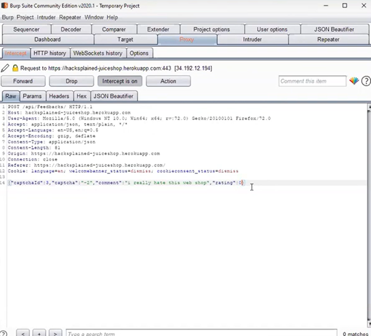
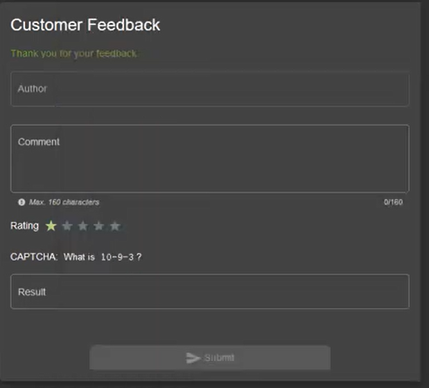
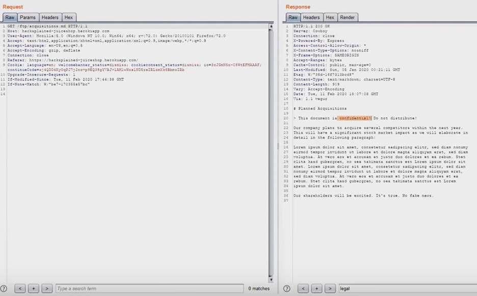
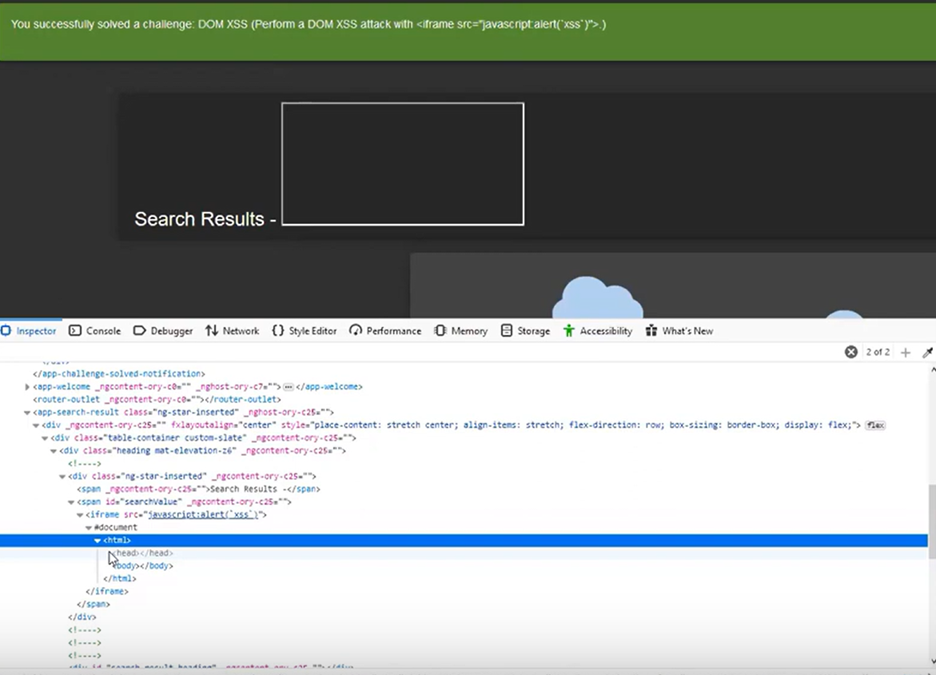
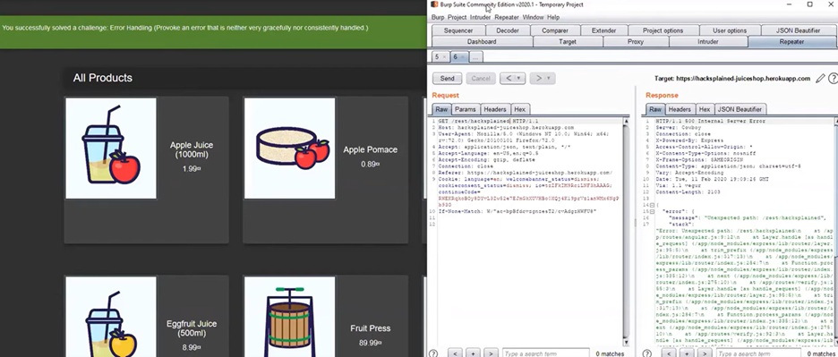
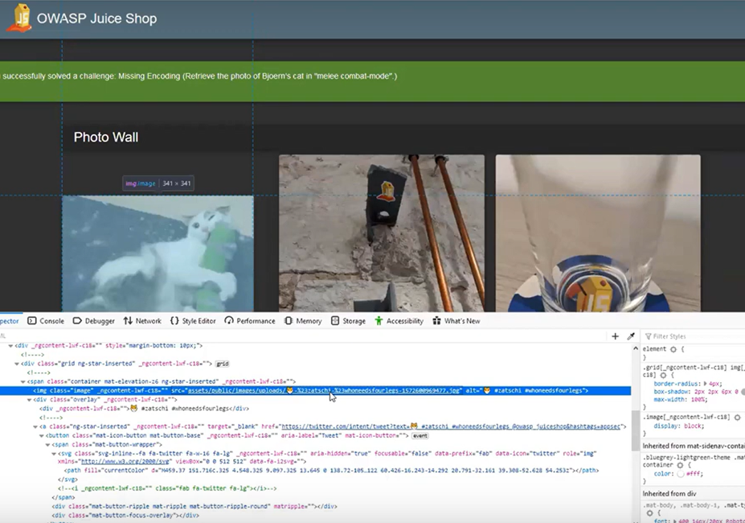
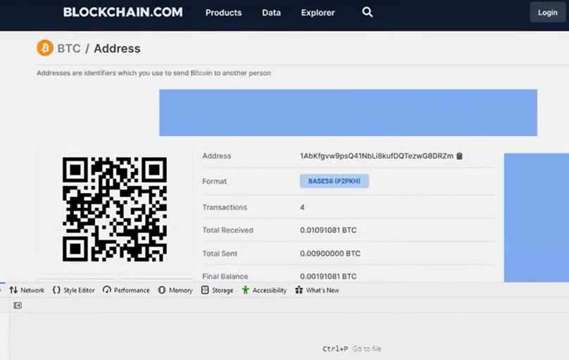

<!DOCTYPE html>
<html>
<head>
    <meta charset="UTF-8">
  
</head>
<body>
<h1>OWASP Juice Shop CTFs</h1>

<h2>Table of Contents</h2>
<ol>
    <li>ITT-340 Final Report Guidelines</li>
    <li>Solving Improper Input Validation (Zero Stars) Challenge</li>
    <li>Confidential Document Exposure</li>
    <li>DOM XSS</li>
    <li>Error Handling (Security Misconfiguration)</li>
    <li>Missing Encoding</li>
    <li>Outdated Whitelist (Unvalidated Redirects)</li>
    <li>Privacy Policy</li>
    <li>Repetitive Registration</li>
    <li>Login Admin</li>
    <li>Classic Stored XSS</li>
    <li>Appendix</li>
    <li>Appendix: A</li>
    <li>Appendix: B</li>
    <li>Appendix: C</li>
    <li>Appendix: D</li>
    <li>Appendix: E</li>
    <li>Appendix: F</li>
    <li>Appendix: G</li>
    <li>Appendix: H</li>
    <li>Appendix: I</li>
    <li>Appendix: J</li>
</ol>

<h2>ITT-340 Final Report Guidelines</h2>
<ul>
    <li><strong>Title:</strong> ITT-340 Pen Testing Report</li>
    <li><strong>Author:</strong> Brady Reid</li>
</ul>

<h3>Versioning Control</h3>
<table border="1" cellpadding="5" cellspacing="0">
    <thead>
        <tr>
            <th>Version</th>
            <th>Date</th>
            <th>Author</th>
            <th>Changes</th>
        </tr>
    </thead>
    <tbody>
        <tr><td>1</td><td>12/15/2024</td><td>Brady Reid</td><td>Improper Input Validation (Zero Stars)</td></tr>
        <tr><td>1.2</td><td>12/15/2024</td><td>Brady Reid</td><td>Confidential Document Exposure (Sensitive Data Exposure)</td></tr>
        <tr><td>1.3</td><td>12/15/2024</td><td>Brady Reid</td><td>DOM XSS (XSS)</td></tr>
        <tr><td>1.4</td><td>12/15/2024</td><td>Brady Reid</td><td>Error Handling (Security Misconfiguration)</td></tr>
        <tr><td>1.5</td><td>12/15/2024</td><td>Brady Reid</td><td>Missing Encoding (Improper Input Validation)</td></tr>
        <tr><td>2.0</td><td>12/15/2024</td><td>Brady Reid</td><td>Outdated Whitelist (Unvalidated Redirects)</td></tr>
        <tr><td>2.2</td><td>12/15/2024</td><td>Brady Reid</td><td>Privacy Policy (Miscellaneous)</td></tr>
        <tr><td>2.3</td><td>12/15/2024</td><td>Brady Reid</td><td>Repetitive Registration (Improper Input Validation)</td></tr>
        <tr><td>2.4</td><td>12/15/2024</td><td>Brady Reid</td><td>Login Admin (Injection)</td></tr>
        <tr><td>2.5</td><td>12/15/2024</td><td>Brady Reid</td><td>Classic Stored XSS (XSS)</td></tr>
    </tbody>
</table>

<h2>Challenges</h2>

<h3>Solving Improper Input Validation (Zero Stars)</h3>

Objective: Exploit a vulnerability caused by insufficient input validation to submit an invalid rating of zero stars.

<strong>Outcome:</strong> The application accepted a zero-star rating, demonstrating a lack of proper input validation.

<h4>Recommendations:</h4>
<ul>
    <li>Implement server-side validation for all inputs.</li>
    <li>Provide immediate client-side feedback using robust validation mechanisms.</li>
    <li>Reject invalid inputs and display clear error messages.</li>
</ul>

<h3>Confidential Document Exposure</h3>

Objective: Exploit a vulnerability in OWASP Juice Shop to access sensitive documents.

<strong>Outcome:</strong> Confidential documents, such as backup.sql, were accessed due to improper access controls.

<h4>Recommendations:</h4>
<ul>
    <li>Enforce strict access controls.</li>
    <li>Disable directory listing on the server.</li>
    <li>Secure files with appropriate permissions.</li>
</ul>

<h3>DOM XSS</h3>

Objective: Exploit a DOM-based XSS vulnerability to execute malicious JavaScript.

<strong>Outcome:</strong> Malicious scripts executed due to improper input handling in the browser's DOM.

<h4>Recommendations:</h4>
<ul>
    <li>Sanitize user inputs with libraries like DOMPurify.</li>
    <li>Avoid using <code>innerHTML</code> or <code>eval</code>.</li>
    <li>Implement Content Security Policy (CSP).</li>
</ul>

<h3>Error Handling (Security Misconfiguration)</h3>

Objective: Exploit an insecure error-handling mechanism that reveals sensitive information.

<strong>Outcome:</strong> Sensitive details, such as stack traces and file paths, were exposed.

<h4>Recommendations:</h4>
<ul>
    <li>Suppress detailed error messages in production environments.</li>
    <li>Use generic error pages.</li>
    <li>Log detailed errors in secure locations.</li>
</ul>

<h3>Missing Encoding</h3>

Objective: Exploit a vulnerability due to missing input encoding, which allows special characters to bypass security mechanisms.

<strong>Outcome:</strong> The application failed to encode user input, enabling malicious payloads to execute.

<h4>Recommendations:</h4>
<ul>
    <li>Encode special characters in HTML, JavaScript, or URLs.</li>
    <li>Use frameworks that handle encoding automatically.</li>
    <li>Implement Content Security Policy (CSP).</li>
</ul>

<h3>Outdated Whitelist (Unvalidated Redirects)</h3>

Objective: Exploit an outdated whitelist to redirect users to unauthorized sites.

<strong>Outcome:</strong> Successfully bypassed whitelist validation, redirecting to malicious URLs.

<h4>Recommendations:</h4>
<ul>
    <li>Validate redirect URLs against strict and updated whitelists.</li>
    <li>Restrict redirections to internal paths only.</li>
    <li>Use security headers to mitigate redirect risks.</li>
</ul>

<h3>Privacy Policy</h3>

Objective: Locate the Privacy Policy page in OWASP Juice Shop to complete the challenge.

<strong>Outcome:</strong> Successfully located and accessed the Privacy Policy page.

<h4>Recommendations:</h4>
<ul>
    <li>Ensure the Privacy Policy is easily accessible from the homepage.</li>
    <li>Regularly update the Privacy Policy to comply with regulations.</li>
    <li>Provide transparency about data collection practices.</li>
</ul>

<h3>Repetitive Registration</h3>

Objective: Exploit validation mechanisms to create duplicate accounts.

<strong>Outcome:</strong> Successfully created duplicate accounts using bypass techniques.

<h4>Recommendations:</h4>
<ul>
    <li>Enforce database constraints for unique email addresses and usernames.</li>
    <li>Implement server-side input normalization.</li>
    <li>Apply rate limiting to prevent abuse.</li>
</ul>

<h3>Login Admin</h3>

Objective: Exploit an SQL Injection vulnerability to log in as the admin user.

<strong>Outcome:</strong> Successfully bypassed authentication to access admin privileges.

<h4>Recommendations:</h4>
<ul>
    <li>Use parameterized queries or ORM frameworks.</li>
    <li>Sanitize user inputs to remove malicious characters.</li>
    <li>Limit database permissions to minimize potential damage.</li>
</ul>

<h3>Classic Stored XSS</h3>

Objective: Exploit a stored XSS vulnerability to execute persistent JavaScript payloads.

<strong>Outcome:</strong> Successfully stored and executed malicious scripts in the application.

<h4>Recommendations:</h4>
<ul>
    <li>Validate and sanitize all user inputs before storage.</li>
    <li>Encode user data when rendering it in the browser.</li>
    <li>Implement a strict Content Security Policy (CSP).</li>
</ul>

<h2>Appendix</h2>
<ul>
    <li>Appendix A: Supporting Diagrams</li>
    <li>Appendix B: Detailed Logs</li>
    <li>Appendix C: Code Snippets</li>
    <li>Appendix D: Tool Configurations</li>
    <li>Appendix E: Vulnerability Details</li>
    <li>Appendix F: Exploitation Screenshots</li>
    <li>Appendix G: Environment Setup</li>
    <li>Appendix H: Assessment Checklist</li>
    <li>Appendix I: References</li>
    <li>Appendix J: Additional Notes</li>
</ul>

      
      
      
      
      
      
      

<strong>Disclaimer:</strong> This report is fictitious and intended for training purposes only. All testing was conducted in a controlled lab environment.

</body>
</html>
